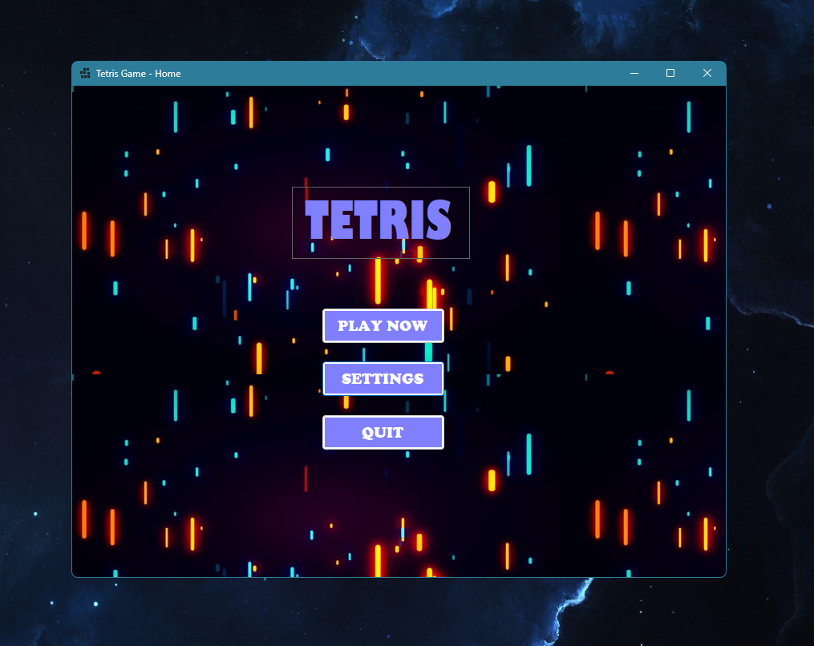
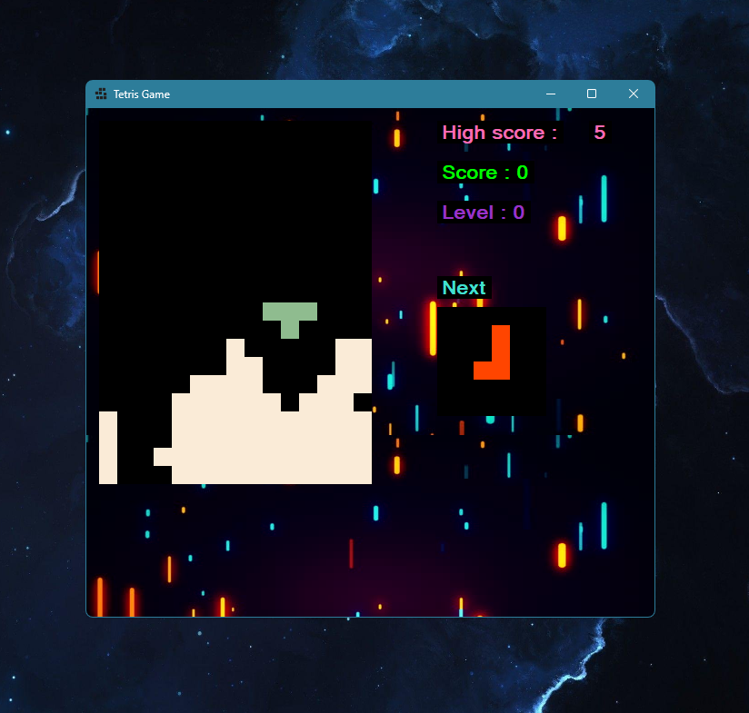
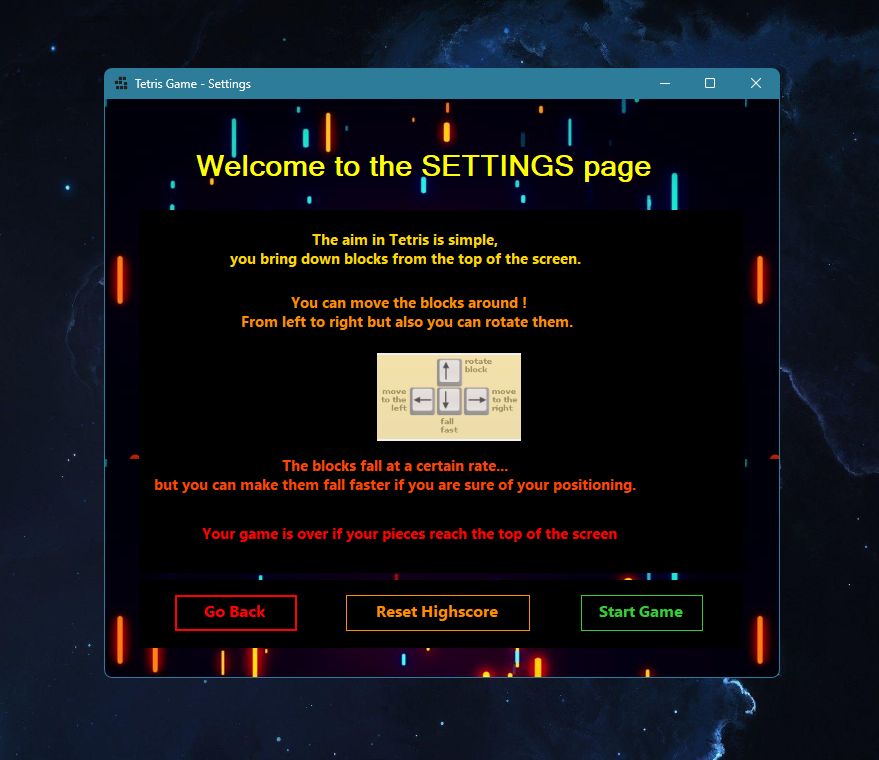

     ████████╗███████╗████████╗██████╗ ██╗███████╗    ██████╗ ██████╗  ██████╗      ██╗███████╗ ██████╗████████╗
     ╚══██╔══╝██╔════╝╚══██╔══╝██╔══██╗██║██╔════╝    ██╔══██╗██╔══██╗██╔═══██╗     ██║██╔════╝██╔════╝╚══██╔══╝
        ██║   █████╗     ██║   ██████╔╝██║███████╗    ██████╔╝██████╔╝██║   ██║     ██║█████╗  ██║        ██║   
        ██║   ██╔══╝     ██║   ██╔══██╗██║╚════██║    ██╔═══╝ ██╔══██╗██║   ██║██   ██║██╔══╝  ██║        ██║   
        ██║   ███████╗   ██║   ██║  ██║██║███████║    ██║     ██║  ██║╚██████╔╝╚█████╔╝███████╗╚██████╗   ██║   
        ╚═╝   ╚══════╝   ╚═╝   ╚═╝  ╚═╝╚═╝╚══════╝    ╚═╝     ╚═╝  ╚═╝ ╚═════╝  ╚════╝ ╚══════╝ ╚═════╝   ╚═╝   
**Groupe :** IRALOUR Claire, BERTIN Pierre-Louis, MEGY Ilyana.

  
  
  

## 🛠 Technologies utilisées

  
  
  

# Sommaire
0. [Tetris](#tetris)
1. [Menu principal](#menu-principal)
2. [Page des options et instructions](#page-des-options-et-instructions)
3. [Interface du jeu](#interface-du-jeu)

## Tetris

Nous avons utilisé Visual Studio avec le template Windows Forms App (.NET Framework) pour créer notre jeu Tetris, codé en C#.
Le jeu comporte différentes pages sur lesquelles le joueur peut naviguer.
En ouvrant le programme, l'utilisateur arrive sur la page du Menu où pourra soit commencer à jouer, soit accéder à la page options/instructions ou quitter le programme.
Les différentes options se présentent sous la forme de boutons.

Nous allons donc détailler le contenu de chaque page ainsi qu'expliquer les méthodes utilisées pour les créées.

## Menu principal

Le menu principal est le premier Form de Windows Forms que nous avons codé. Nous avons opté pour un design un peu rétro pour l’esthétique du jeu.
C'est une simple page contenant un Label pour le titre et trois boutons qui redirigent chacune sur la page correspondant.

Pour les boutons qui permettent d'accéder à l'interface du jeu et pour accéder aux options sont développé de tel que l'utilisateur est redirigé et la page du menu est cachée.

Le bouton ``Exit Game`` interrompt le programme.

## Page des options et instructions

Cette page est une page simplement constituée des règles du jeu et de trois boutons;
Un premier bouton ``Go Back`` permet à l'utilisateur de retourner au menu principal, pour cela le programme va simplement fermer la page actuelle et afficher le menu qui avait été caché (``hidden``).

Le deuxième va réinitialiser le ``Highscore`` à 0.

Et enfin ``Start Game`` qui redirige vers l'interface du jeu.

## Interface du jeu
(magnifique transition)

La page du jeu est le deuxième Form que nous avons codé.
Elle se compose d'un espace à gauche où l'utilisateur joue et à droite on a des statistiques de jeu avec:
- le ``Highscore`` qui est par défaut établi à 0, si le joueur bat le record, la valeur s'adapte. Pour ajouter cette fonctionnalité on créé une nouvelle propriété dans les options du projet, puis lors d'un ``Game Over`` nous mettons à jour la valeur du record si l'utilisateur l'a battu. (voir ci-dessous pour mieux comprendre)

---

- Nous avons ensuite le ``Score`` et qui s'incrémente lorsque le joueur supprime une ligne.
- Le ``Level`` quant à lui augmente de 1 tous les 10 lignes effacées.
- Nous avons aussi rajouter un ``Timer`` qui permet d'augmenter la vitesse de descente des objets Tetris au fur et à mesure du jeu, cela augmente alors la difficulté du jeu.

- Et enfin ``Next`` qui permet au joueur de voir quel est le prochain objet.

Le jeu démarre dès lors que le joueur accède à l'interface du jeu.
Son score et son niveau sont donc initialisés à 0, le joueur peut voir le prochain objet qui va arriver dans la boîte du ``Next``, le chrono (``timer``) démarre et le premier objet commence sa descente.

Le joueur à la possibilité de bouger l'objet vers la gauche ou la droite en utilisant les touches ``Left`` et ``Right`` du clavier, il peut également accélérer la chute de l'objet avec la touche ``Down`` du clavier et enfin il peut faire tourner l'objet à 90° avec la touche ``Up`` si il en a la possibilité.

Une fois que l'objet atteint le sol ou s'il se pose sur un autre objet, le joueur n'a plus la possibilité de le bouger et un nouvel objet apparaît en haut (l'objet prédit dans la boîte du ``Next`` précédemment.).
Le ``Next`` affiche un nouvel objet pour le prochain coup ect...

Si le joueur arrive à remplir tous les espaces d'une ligne, alors celle-ci se détruit et le score incrémente de 1 et la vitesse augmente un peu.

Le programme vérifie une fois l'objet posé que le joueur n'est pas ``Game Over``.

Si un objet posé dépasse le haut de l'interface, alors le joueur a perdu.
Le joueur est alors redirigé vers la page du menu principal.

Voilà donc comment ce présente notre projet du jeu Tetris codé en C#.
Je mets le lien vers le GitHub → [ICI](https://github.com/IlyanaMegy/Tetris_Project) ←

Vous pouvez y jeter un oeil, pour ça vous aurez juste besoin du logiciel [Visual Studio](https://visualstudio.microsoft.com/fr/vs/), importez le projet et appuyez sur le bouton ``Start``.

PEACE.
